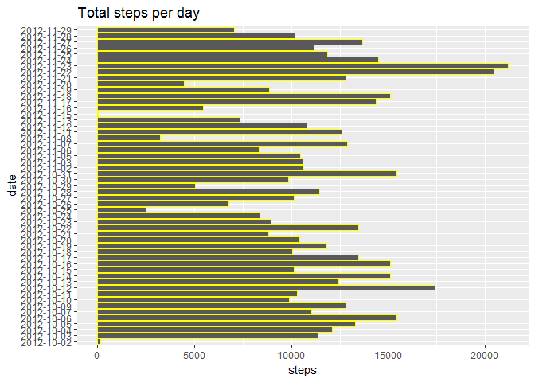
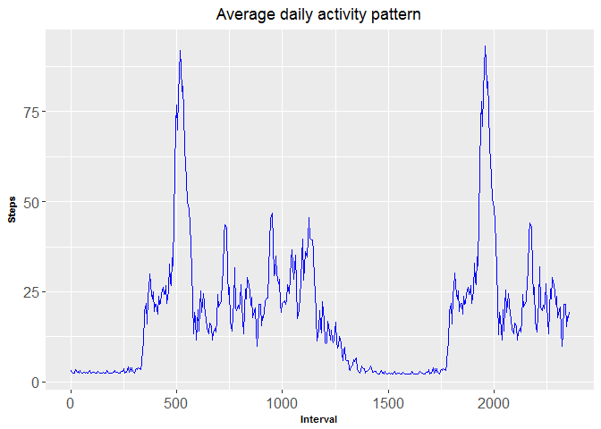
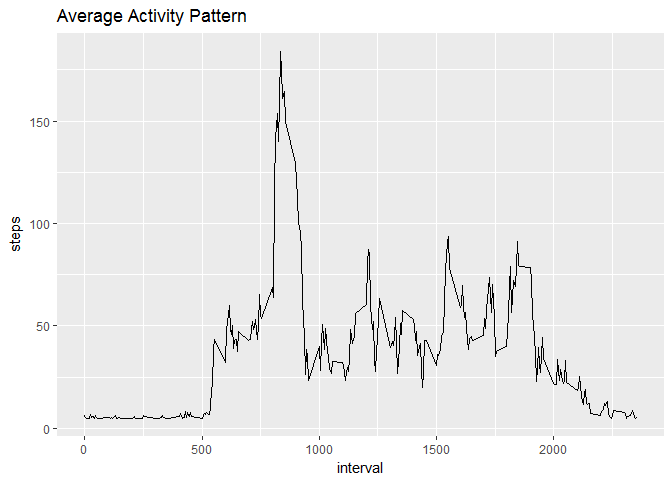
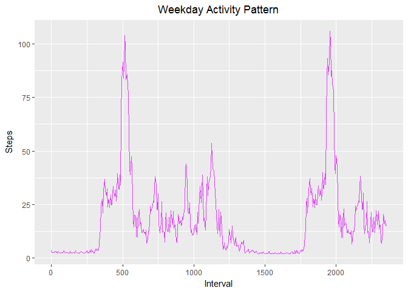
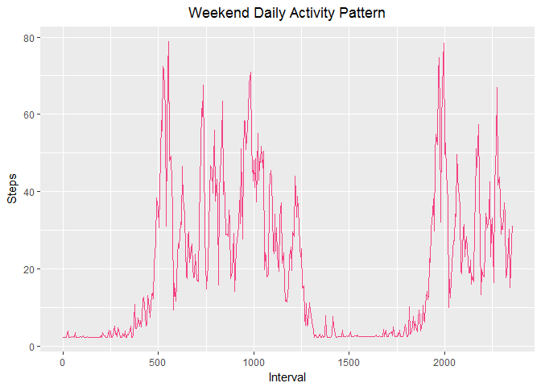

# Reproducible Research: Peer Assessment 1


## Loading and preprocessing the data


```r
if(!file.exists("./activityMonitoringData"))
  {dir.create("./activityMonitoringData")}
fileUrl <- "https://d396qusza40orc.cloudfront.net/repdata%2Fdata%2Factivity.zip"
download.file(fileUrl,destfile="./activityMonitoringData.zip",method="libcurl")
unzip(zipfile="./activityMonitoringData.zip",exdir="./data")
pathFile <- file.path("./data" , "activity.csv")
activityData <- read.table(pathFile, sep = ",", header = T)
summary(activityData)
```

```
##      steps                date          interval     
##  Min.   :  0.00   2012-10-01:  288   Min.   :   0.0  
##  1st Qu.:  0.00   2012-10-02:  288   1st Qu.: 588.8  
##  Median :  0.00   2012-10-03:  288   Median :1177.5  
##  Mean   : 37.38   2012-10-04:  288   Mean   :1177.5  
##  3rd Qu.: 12.00   2012-10-05:  288   3rd Qu.:1766.2  
##  Max.   :806.00   2012-10-06:  288   Max.   :2355.0  
##  NA's   :2304     (Other)   :15840
```
It can be observed from the summary data that there is 2304 NA values. Alternatively it can be calculated as shown below


```r
nrow( activityData[ activityData$steps=="NA", ])
```

```
## [1] 2304
```

## Evaluating the total number of steps taken per day ignoring the missing data


```r
Total_steps <- aggregate(steps ~ date, activityData, sum)
head(Total_steps)
```

```
##         date steps
## 1 2012-10-02   126
## 2 2012-10-03 11352
## 3 2012-10-04 12116
## 4 2012-10-05 13294
## 5 2012-10-06 15420
## 6 2012-10-07 11015
```

## Making a histogram of the total number of steps taken each day


```r
library(ggplot2)
ggplot(Total_steps, aes(x = date, y = steps)) + labs(title="Total steps per day") +
        geom_bar(stat = "identity", color= "yellow") + coord_flip()
```

<!-- -->


```r
Steps <- round(mean(activityData$steps, na.rm = T), 0)
Steps
```

```
## [1] 37
```

Replacing the NAs with the mean steps
Imputing missing values


```r
activityData$steps[which(is.na(activityData$steps))] <- Steps
head(activityData)
```

```
##   steps       date interval
## 1    37 2012-10-01        0
## 2    37 2012-10-01        5
## 3    37 2012-10-01       10
## 4    37 2012-10-01       15
## 5    37 2012-10-01       20
## 6    37 2012-10-01       25
```

## What is the average daily activity pattern?


```r
Interval <- seq(0, 2355, 5)
list0 <- seq(1: length(Interval)) 
Steps <- numeric(length(list0))
for(i in list0)
{
   list1 <- seq(i, 17568, 288)
   meansList <- numeric(length(list1))
   
     for(j in list1)
       {
         meansList[j] <- activityData[j, 1]
       }
 Steps[i] <- mean(meansList, na.rm = T)
}
library(ggplot2)
df1 <- data.frame(Interval, Steps)
ggplot(df1, aes(Interval,Steps)) + geom_line(color = "blue", size=1/4, alpha=1) + labs(title="Average daily activity pattern") + theme(plot.title = element_text(hjust = 0.5)) + theme(axis.text=element_text(size=12),
        axis.title=element_text(size=8,face="bold"))
```

<!-- -->


Which 5-minute interval, on average across all the days in the dataset, contains the maximum number of steps?


```r
highestNumberOfSteps <- max(activityData$steps)
subset(activityData, activityData$steps == max(activityData$steps))$interval
```

```
## [1] 615
```


## Are there differences in activity patterns between weekdays and weekends?

Showing the days of the week


```r
activityData$date <- weekdays(as.Date(activityData$date))
str(activityData)
```

```
## 'data.frame':	17568 obs. of  3 variables:
##  $ steps   : num  37 37 37 37 37 37 37 37 37 37 ...
##  $ date    : chr  "Monday" "Monday" "Monday" "Monday" ...
##  $ interval: int  0 5 10 15 20 25 30 35 40 45 ...
```

Selecting week days data only


```r
weekdaysActivity <- subset(activityData, activityData$date=="Monday"| activityData$date=="Tuesday" |activityData$date=="Wednesday"| activityData$date=="Thursday" | activityData$date=="Friday")
head(weekdaysActivity)
```

```
##   steps   date interval
## 1    37 Monday        0
## 2    37 Monday        5
## 3    37 Monday       10
## 4    37 Monday       15
## 5    37 Monday       20
## 6    37 Monday       25
```


```r
library(ggplot2)
df1 <- aggregate(steps ~ interval, activityData, mean)
ggplot(df1, aes(x = interval, y = steps)) + labs(title="Average Activity Pattern") +
        geom_line()
```

<!-- -->


```r
Interval <- seq(0, 2355, 5)
list0 <- seq(1: length(Interval)) 
Steps <- numeric(length(list0))
for(i in list0)
{
   list1 <- seq(i, 12960, 288)
   meansList <- numeric(length(list1))
   
     for(j in list1)
       {
         meansList[j] <- weekdaysActivity[j, 1]
       }
 Steps[i] <- mean(meansList, na.rm = T)
}
df2 <- data.frame(Interval, Steps)
ggplot(df2, aes(Interval,Steps)) + geom_line(color = "#df42f4", size=1/4, alpha=1) + labs(title="Weekday Activity Pattern") + theme(plot.title = element_text(hjust = 0.5))
```

<!-- -->

Selecting weekend days data only


```r
weekendActivity <- subset(activityData, activityData$date=="Saturday"| activityData$date=="Sunday")
```

The weekend pattern

```r
Interval <- seq(0, 2355, 5)
list0 <- seq(1: length(Interval)) 
Steps <- numeric(length(list0))
for(i in list0)
{
   list1 <- seq(i, 4608, 288)
   meansList <- numeric(length(list1))
   
     for(j in list1)
       {
         meansList[j] <- weekendActivity[j, 1]
       }
 Steps[i] <- mean(meansList, na.rm = T)
}
df3 <- data.frame(Interval, Steps)
ggplot(df3, aes(Interval,Steps)) + geom_line(color = "#f44283", size=1/4, alpha=1) + labs(title="Weekend Daily Activity Pattern") + 
  theme(plot.title = element_text(hjust = 0.5))
```

<!-- -->


##Observations and Conclusions


The peak steps are around the intervals 500 and 2000 for week days. The peaks higher than
weekend days peaks. Weekdays have the lower number of steps walked between intervals 500 and 1250 compared to the similar interval over the weekends.

It can be concluded that the weekends have more activity than weekdays.


